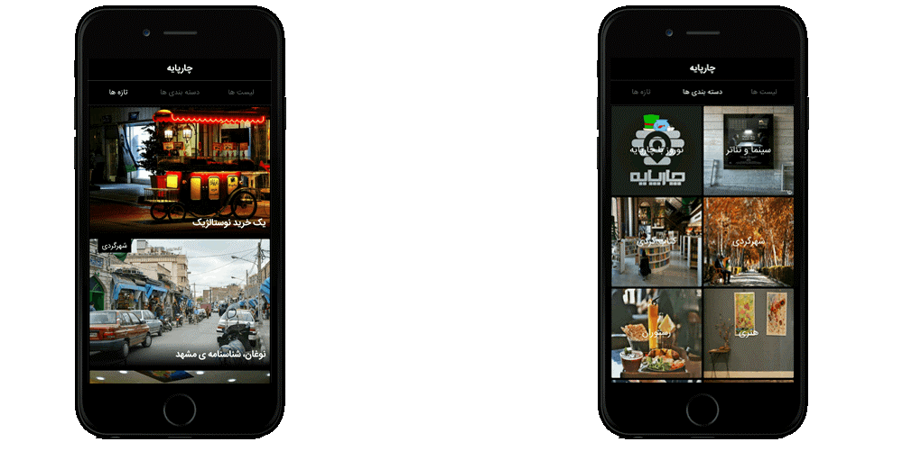

```html
Applux represents a unity of professionals with a diverse range of complementary and intersecting skillsets, with the goal of bringing businesses solutions with the use of modern tech. With the members collaborating with each other to reach results, Applux's philosophy is built on the notion that the whole is greater than the individual parts.
<br><br>
Services include but are not limited to web development, mobile and tablet application development, systems analysis, project management and financial analysis.

```

```html
<!--  APPLICATION DEVELOPMENT SECTION -->

<!-- Navbar smooth scrolling -->
<div id="mobile" ></div>

<h2 style="font-weight: bold; text-align: center;">APPLICATION DEVELOPMENT</h2>
<h2 style="margin-top: 0px; text-align: center;">iOS • Android • Tablet</h2>

<br>

<div class="about-tbl-height" style="height: 100px;">
  <p>
    We offer a variety of mobile app and analytics to help increase business’ performance. Applux ensures your mobile app will be attractive and easy-to-use. We have a dedicated mobile application development team that has the skills and the experience to develop solutions for all major mobile operating systems, including: iOS, Android, and Windows Phone.
  </p>
</div>

<br>

<div style="height: 2150px; color: #fff; margin-left: 10%; border-radius: 15px; width: 80%;">
  <div style="padding: 30px;">

      <hr style="margin: 30px 10%;">

      <div class="tbl-row-intro">
        <div class="tbl-col-front-end-l" style="height: 500px;">
          <div class="img-txt-container">
            
            <!-- <div class="btm-left"><a href="http://ec2-52-14-27-203.us-east-2.compute.amazonaws.com/catalog/"><p class="demo-style">demo</p></a></div> -->
          </div>
        </div>
        <div class="tbl-col-front-end-r" style="height: 500px;">
          <p style="padding: 0 10px; width: 250px; background: #00D4F1; color:rgba(32, 31, 36, 1);">Define Business Challenges</p>

          <p>Mobile apps solves our daily challenges, and makes life easier. At the first step, we’ll identify the foundational obstacles within the business that a mobile solution can solve.</p>

          <p style="padding: 0 10px; width: 250px; background: #00D4F1; color:rgba(32, 31, 36, 1);">Identify Target Audience</p>

          <p>Knowing the target audience enables companies to build the perfect app for their needs.</p>
          <p>We’ll plan the app’s user experience (UX) to serve the users’ particular needs, expectations and behaviors.</p>

          <p style="padding: 0 10px; width: 300px; background: #00D4F1; color:rgba(32, 31, 36, 1);">A Proactive Approach to Security</p>
          <p>We provide the security defenses to keep the user and company’s data secure. We keep your solution protected from the very start.</p>
        </div>
      </div>

      <hr style="margin: 30px 10%;">

      <div class="tbl-row-intro">
        <div class="tbl-col-front-end-l" style="height: 400px;">
          <div class="img-txt-container">
            
            <!-- <div class="btm-left"><a href="http://ec2-52-14-27-203.us-east-2.compute.amazonaws.com/catalog/"><p class="demo-style">demo</p></a></div> -->
          </div>
        </div>
        <div class="tbl-col-front-end-r" style="height: 400px;">

          <p style="padding: 0 10px; width: 250px; background: #00D4F1; color:rgba(32, 31, 36, 1);">User Interface Design</p>
          <p>Our designers create stunning, intuitive screens users will love to interact with. From excellent typography to gorgeous color  and contrast.</p>
          <p style="padding: 0 10px; width: 250px; background: #00D4F1; color:rgba(32, 31, 36, 1);">User Experience Design</p>
          <p>Our talented teams design every app we build to be user-friendly and just fun to use.</p>

        </div>
      </div>

      <hr style="margin: 30px 10%;">

      <div class="tbl-row-intro">
        <div class="tbl-col-front-end-l" style="height: 350px;">
          <div class="img-txt-container">
            
            <!-- <div class="btm-left"><a href="http://ec2-52-14-27-203.us-east-2.compute.amazonaws.com/catalog/"><p class="demo-style">demo</p></a></div> -->
          </div>
        </div>
        <div class="tbl-col-front-end-r" style="height: 350px;">
          <p style="padding: 0 10px; width: 120px; background: #00D4F1; color:rgba(32, 31, 36, 1);">Capitan</p>

          <p>Capitan is a mobile application designed for sports enthusiasts. All types of news and coverage relating to national and international are included.</p>
          <p>Some of the noteworthy features of this app inlcude:</p>
          <ul>
            <li>notifications of breaking news and live results</li>
            <li>read news in offline mode</li>
            <li>users are able to create profiles with various functionality</li>
            <li>discuss with other users each news piece</li>
            <li>view highlights with a custom-designed video player</li>
          </ul>
        </div>
      </div>

      <hr style="margin: 30px 10%;">

      <div class="tbl-row-intro">
        <div class="tbl-col-front-end-l" style="height: 350px;">
          <div class="img-txt-container">
            
            <!-- <div class="btm-left"><a href="http://ec2-52-14-27-203.us-east-2.compute.amazonaws.com/catalog/"><p class="demo-style">demo</p></a></div> -->
          </div>
        </div>
        <div class="tbl-col-front-end-r" style="height: 350px;">
          <p style="padding: 0 10px; width: 120px; background: #00D4F1; color:rgba(32, 31, 36, 1);">Chaarpaye</p>

          <p>In Chaarpaye, users are notified on a daily basis all the events and absorbent places of Mashhad; including: cafes, restaurants, theater, etc. As an urban journal and users will become acquainted with the most appealing places and events in their city.</p>

          <p style="font-size: 12px;">All the information and reports are provided by our curious adventurer “Chaarpaye Neshin”.</p>

      </div>
    </div>
  </div>
</div>

<hr style="margin: 0; padding: 0;">

<!--  BUSINESS SOLUTIONS SECTION -->

<!-- Navbar smooth scrolling -->
<div id="business" ></div>

<h2 style="font-weight: bold; text-align: center;">BUSINESS SOLUTIONS</h2>
<h2 style="margin-top: 0px; text-align: center;">Systems Analysis • Workflow Optimization</h2>

<br>

<div class="about-tbl-height" style="height: 250px; text-align: center;">
  <p>
    In the world of tech, industrial advancements have only been accelerating, which leaves businesses left to adapt to the standard. In doing so, managers have to decide whether they want to mold themselves around a preexisting software package, or better yet design one that adapts to their business needs. The catch is change requires businesses to allot the time, dedication and expertise to make these changes happen, which includes sifting through presentations for these packages...
  </p>
  <p>
    <b>Why not consult a business that can prescribe the best solution for you?</b>
  </p>
  <p>
    This is where Applux comes in! With Applux's preexisting expertise and passion for the tech that make the wheels accelerate faster, the best and most efficient solution is developed tailored to a business' need, with competitive pricing to add.
  </p>
</div>

<div style="height: 1150px; color: #fff; margin-left: 20%; border-radius: 15px; width: 60%;">

    <!-- <hr style="margin: 30px 10%;">
    <div class="about-tbl-height" style="height: 150px; margin-left: 0; text-align: center;">
      <p>Why do businesses have to adapt their process to existing software?</p>
      <p>Why do managers have to change their own procedures according to software policies?</p>
      <p>Why does your company have to manage software that you have no role in designing?</p>
      <p>Why spend an excess amount of time on every software company’s presentation ?</p>
      <p>Let APPLUX help you find the best choice for your business!</p>
      <p>APPLUX does not offer a all incompassing software for every business.</p>
      <p>APPLUX tailors a solution for your company.</p>
      <p>APPLUX can develop a software with your specific needs in mind, or consult with you on which preexisting software package you could adapt your process to.</p>
    </div> -->

    <hr style="margin: 30px;">

    <div class="tbl-row-intro" style="height: 330px;">
      <div class="tbl-col-front-end-l">
        
      </div>
      <div class="tbl-col-front-end-r">
      <p>Implementation System Management</p>
      <p>First, Applux will learn about your business, the past process and what the business is striving for:</p>
      <p style="padding: 0 10px; width: 180px; background: #00D4F1; color:rgba(32, 31, 36, 1);">I.	System Analysis</p>
      <ol>
        <li>Design your Process</li>
        <li>Process Improvement</li>
        <li>Defined Process control and measurement</li>
      </ol>
      </div>
    </div>

    <hr style="margin: 30px;">

    <div class="tbl-row-intro" style="height: 330px;">
      <div class="tbl-col-front-end-l">
        
      </div>
      <div class="tbl-col-front-end-r">

      <p>Next, Applux's staff will design an optimal solution for your business according to real processes, matching to your exact business needs.</p>
      <p style="padding: 0 10px; width: 320px; background: #00D4F1; color:rgba(32, 31, 36, 1);">II.	Management information systems</p>
      <ol>
        <li>System Architecture</li>
        <li>System integration</li>
        <li>System implementation</li>
        <li>Training</li>
      </ol>
      <p>To conclude, Applux's consultants will provide effective solutions and competitive pricing with positive outcomes of the business in mind.</p>
      </div>
    </div>


  </div>
</div>

<hr>
```


OLD ABOUT SECTION

```html
<div class="encompass">

  <div class="add-twenty"></div>

  <h2>ABOUT APPLUX</h2>

  <br>

  <div class="tbl-row-portraits">

  </div>


  <div class="about-tbl-height">


    <div style="padding: 30px;">

          <p style="text-align: center;">
            Applux is run by Emerson Pourghaed, with the occasional assistance of other professionals that complement him in the field. The primary services that the group brings is web development, and Applux has members experienced in Mobile App Development, system administration and business solutions.
            <br>
            <br>
            Emerson first got into web development in middle school as a leisurely activity, creating static webpages with friends and designing CSS templates for message boards. He decide to pursue web development after using Python for descriptive statistic purposes, eventually leading to creating his first back end webpage using Flask. He has since broadened his skillset, and delivers sites for different occasions and purposes.

    </div>
  </div>
</div>
```
